---
# You can also start simply with 'default'
theme: the-unnamed
# random image from a curated Unsplash collection by Anthony
# like them? see https://unsplash.com/collections/94734566/slidev
background: https://images.unsplash.com/photo-1619075120156-f5729c752edf?q=80&w=2942&auto=format&fit=crop&ixlib=rb-4.1.0&ixid=M3wxMjA3fDB8MHxwaG90by1wYWdlfHx8fGVufDB8fHx8fA%3D%3D
# some information about your slides (markdown enabled)
title: ch 14 處理巢狀資料的函數式工具 Functional tools for nested data
info: ch 14 處理巢狀資料的函數式工具 Functional tools for nested data
# apply unocss classes to the current slide
class: text-center
# https://sli.dev/features/drawing
drawings:
  persist: false
# slide transition: https://sli.dev/guide/animations.html#slide-transitions
transition: slide-left
# enable MDC Syntax: https://sli.dev/features/mdc
mdc: true
# open graph
# seoMeta:
ogImage: https://drek4537l1klr.cloudfront.net/normand/Figures/rabbit.jpg

fonts:
  # 与 css 中的 font-family 一致，你可以使用 `,` 来分割字体名，便于回退
  sans: 'MapleMono-Regular, MapleMonoNormal-NF-CN-Medium,Robot'
  serif: Robot Slab
  mono: 'MapleMono-Regular, MapleMonoNormal-NF-CN-Medium'
  weights: '200,400,600'
  italic: false
  local: MapleMonoNormal-NF-CN-Medium

---

# CH 14 處理巢狀資料的函數式工具

## 《簡約軟體開發思維用 Functional Programming 重構程式以 JavaScript 為例》 讀書會

2025/06/26

導讀人：Ashley


<div class="abs-br m-6 text-xl">
  <button @click="$slidev.nav.openInEditor()" title="Open in Editor" class="slidev-icon-btn">
  </button>
</div>


---
transition: slide-up
layout: section
---

# 自我介紹
<br/>

## 導讀人：Ashley

- 👩‍💻 近 4 年前端開發經驗
- 🛠 擅長開發 React 、React Native
- 💼 目前在新創公司擔任前端工程師


---
layout: default
transition: slide-up
---

# 前次回顧: 

## CH 12 利用函式走訪

- `map()` 會利用回呼函式處理陣列中的每個元素，並且一一轉換成新陣列的元素。
- `filter()` 會選取傳入陣列中的部分元素，並且加入新陣列中。選取的標準是由你所傳入的謂語函式決定。
- `reduce()` 會以給定的初始值為基礎，將傳入陣列中的元素『合併』成一個值。這個值可以是數字、字串、物件或陣列等任何類型。

<!--
在我們開始今天的主題之前，先快速回顧一下第 12 章的內容。
我們學習了三個非常核心的陣列操作函式：map、filter 和 reduce。
- map 是做「轉換」，把陣列中的每個元素變成新的樣子。
- filter 是做「篩選」，根據條件挑出想要的元素。
- reduce 是做「彙整」，把整個陣列濃縮成一個單一的值。
這三個工具是函數式程式設計的基礎，我們今天的討論也會建立在這些概念之上。
-->

---
layout: default
transition: slide-up
---

# 前次回顧: 

## CH 13 串聯函數式工具

- 可以將多個函數式工具串聯成多步驟的鏈（chain）。利用此做法，複雜的資料計算可以被分解成一組簡單的小動作。
- 可以將函數鏈視為一種查詢語言，ex: SQL。串成鏈的函數式工具可以表達對陣列資料的複雜查詢。
- 為了撰寫函式鏈的下一步，有時需要先產生新資料或是擴充既有資料。

<!--
接著是第 13 章，我們學會了如何將這些工具「串」起來使用。
就像工廠的流水線一樣，我們可以把資料放上去，經過 map 的加工、再經過 filter 的篩選，最後得到我們想要的結果。
這種串聯的寫法，讓複雜的資料處理邏輯變得像是在寫一篇英文句子或是一個 SQL 查詢，非常清晰易懂。
-->

---
layout: default
transition: slide-up

---

# 本次導讀目標：CH 14 處理巢狀資料的函數式工具

<br/>

- 建⽴⾼階函式操作 hashmap 中的數值。
- 學習⽤高階函式輕鬆處理深度巢狀資料 •
- 瞭解遞迴以及如何安全地執行•
- 判斷何時在深度巢狀結構上套用抽象屏障。

<!--
好的，回顧完畢，讓我們進入今天的主題。
今天我們的目標有四個：
第一，我們要將之前操作陣列的思維，延伸到操作物件（也就是書中說的 hashmap）。
第二，我們會學習如何處理不只一層，而是很多層的巢狀資料。
第三，我們會談到一個強大的技術「遞迴」，以及如何安全地使用它。
最後，我們會討論一個重要的設計模式，叫做「抽象屏障」，它可以幫助我們管理複雜的資料操作。
-->

---
layout: default
 
---
# 14.1 用高階函式處理物件內的值

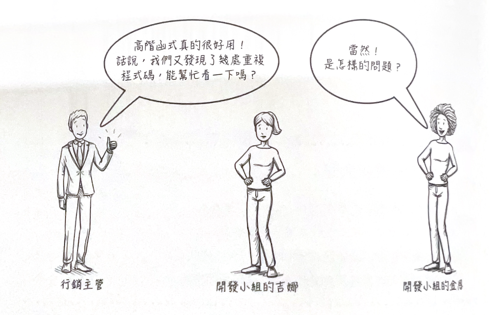


---
layout: default
---
# 14.2 讓屬性名稱變顯性

為了讓顧客能增加『商品數量』與『衣服尺⼨』，⾏銷部門先撰寫了以下程式碼：

<div grid="~ cols-2 gap-4">


<div >
  
```js
function incrementQuantity(item) {
    var quantity = item['quantity'];
    return newItem;
}
```
<p >函式名稱包含 quantity 的商品屬性。</p>
</div>
<div>

```js
function incrementSize(item) {
    var size = item['size'];
    return newItem;
}
```
<p >函式名稱包含 size 的商品屬性。</p>
</div>

</div>

<!--
這裡有一個很常見的程式碼異味（code smell）。
我們有兩個函式，一個用來增加數量，一個用來增加尺寸。
大家有沒有發現，這兩個函式長得幾乎一模一樣？唯一的差別只在於它們操作的屬性名稱不同，一個是 'quantity'，一個是 'size'。
這個屬性名稱，就是所謂的「隱性引數」，它被藏在函式的名字裡了。
-->

---
layout: section

---


<div v-click.hide>含有程式碼異味的程式</div>

<div v-after>將屬性名稱轉為顯性</div>

````md magic-move {at:1, lines: true}


```js
function incrementQuantity(item) {
    var quantity = item['quantity'];
    var newQuantity = quantity + 1;
    var newItem = objectSet(item, 'quantity', newQuantity);
    return newItem;
}
```

```js 
function incrementField(item, field) {
    var value = item[field];
    var newValue = value + 1;
    var newItem = objectSet(item, field, newValue);
    return newItem;
}
```
````
<!--我們可以做一個簡單的重構，把這個隱性的引數變成顯性的。 也就是說，我們把屬性名稱從函式名稱中拿出來，變成一個真正的參數 `field`。 這樣一來，`incrementField` 這個函式就變得更通用了，它可以增加任何我們傳入的 `field` 的值
-->

---
layout: section

---
對負責『increment（增加）』、『 decrement（減少）』 、『 double（加倍）』 和 『 halve（減半）』等四項操作的函式做相同重構後，重複的程式碼就又出現了：

<div grid="~ cols-2 gap-4">
```js {*|3,10}
function incrementField(item, field) {
    var value = item[field];
    var newValue = value + 1;
    var newItem = objectSet(item, field, newValue);
    return newItem;
}

function decrementField(item, field) {
    var value = item[field];
    var newValue = value - 1;
    var newItem = objectSet(item, field, newValue);
    return newItem;
}
```

```js {*|3,10}
function doubleField(item, field) {
    var value = item[field];
    var newValue = value * 2;
    var newItem = objectSet(item, field, newValue);
    return newItem;
}

function halveField(item, field) {
    var value = item[field];
    var newValue = value / 2;
    var newItem = objectSet(item, field, newValue);
    return newItem;
}
```
</div>
<div v-click class="text-center font-bold mt-6 ">函式名稱中的隱性引數 </div>

<!--note 好，我們解決了一個問題，但馬上又出現了新的重複。 現在我們有四個函式，分別用來做「加」、「減」、「加倍」、「減半」。 它們的結構還是一樣，都是先取得屬性值，然後做某個操作。 這次，隱藏在函式名稱裡的隱性引數，變成了「要執行的操作」本身。 -->

---
layout: default
---

# 14.3 實作更新物件內屬性值的 update()

寫⼀個能更新（update）物件內屬性值的函數式工具，進而消除程式碼重複。

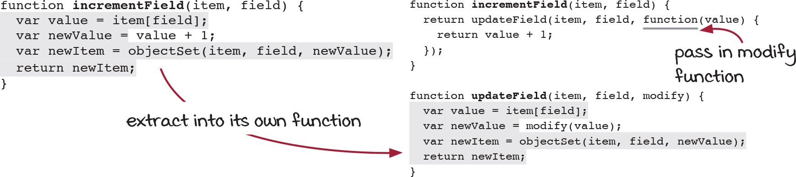


- 將隱性引數轉換為顯性
- 以回呼取代主體實作

<!-- 為了解決這個問題，我們需要一個更強大的工具。 我們的目標是建立一個通用的 `update` 函式。 這個函式會把「要執行的操作」也當成一個參數傳進來。 這個「操作」本身就是一個函式，也就是我們常說的「回呼函式 (callback)」。 這就是高階函式的威力：函式可以作為另一個函式的參數。 -->


---
layout: section

---

不需要強調此函式修改的是 Field 屬性，因此我們可以將其重命名為 `update()`。

同時，普適化各參數的名稱。

```js {*|2|3|4}
function update(object, key, modify) {
    var value   = object[key]; //取得屬性值
    var newValue = modify(value); //修改屬性值
    var newObject = objectSet(object, key, newValue); //設定新物件
    return newObject;
}
```

<!-- 這就是我們 `update` 函式的基本樣貌。 它需要三個參數： 1. `object`：我們要操作的目標物件。 2. `key`：我們要更新的屬性名稱。 3. `modify`：一個回呼函式，它會接收屬性的舊值，並回傳新值。 這個函式完美地將「操作哪個物件的哪個屬性」和「如何操作」這兩件事分離開來。 -->
---
layout: default
---

# 14.4 以 update() 修改物件屬性


假設某公司將員工資訊存放在物件中

```js
var employee = {
    name: "Kim",
    salary: 120000
};
```

人事部門想為該員工加薪10%，此時就需要 `raise10Percent()`：該函式接受『加薪前薪資』，並傳回『漲
10%後』的結果：

```js
function raise10Percent(salary) {
    return salary * 1.1;
}
```

<!-- 讓我們來看一個實際的範例。 假設我們有一個員工物件，裡面有姓名和薪水。 現在我們要幫這位員工加薪 10%。 我們可以先定義一個 `raise10Percent` 函式，這個函式很單純，就是一個計算函式，它接收一個薪資，然後回傳乘以 1.1 的結果。 -->

---
layout: section
---

```js {monaco-run}
function objectSet(object, key, value) {
    return {
        ...object,
        [key]: value
    };
}

function update(object, key, modify) {
    var value= object[key]; 
    var newValue= modify(value); 
    var newObject = objectSet(object, key, newValue);
    return newObject;
}

var employee = {
    name: "Kim",
    salary: 120000
};

function raise10Percent(salary) {
    return salary * 1.1;
}

var updatedEmployee = update(employee, 'salary', raise10Percent);
console.log('employee', JSON.stringify(employee,null,2)); 
console.log('updatedEmployee', JSON.stringify(updatedEmployee,null,2)); 

```
<!-- 現在，我們可以把 `employee` 物件、`'salary'` 這個鍵，以及 `raise10Percent` 這個操作函式，一起傳給 `update`。 `update` 函式會回傳一個新的員工物件 `updatedEmployee`。 大家可以注意看執行結果，原始的 `employee` 物件完全沒有被改變，這就是「不可變性 (Immutability)」的重要特性。 -->

---
layout: default
---

## update() 會修改原本 hash map 的資料嗎？
<p v-click>
不會，`update()` 不會更動原始 hash map ，會複製原本的物件，並回傳一個新的物件。
</p>
<br/>
<br/>

## 但假如我們在 `update()` 不會修改原始物件，那該怎麼使用？

<p v-click>
只要用 `update()` 回傳的物件取代原本的物件即可。

```js
var employee = {
    name: "Kim",
    salary: 120000
};
employee = update(employee, 'salary', raise10Percent);
```
</p>

<!-- 這裡要特別強調，`update` 是一個純函式，它不會產生副作用，也就是不會去修改傳入的物件。 它只會回傳一個新的、更新過的物件。 那如果我們真的想要「儲存」這個變更呢？ 很簡單，只要把 `update` 回傳的新物件，重新賦值給原本的變數就可以了。 這是在函數式程式設計中處理狀態改變的標準做法。 -->

---
layout: default
---
# 14.5 重構 3 : 以 update() 取代 『取得、修改、設定』

<div grid="~ cols-2 gap-4">
<div>
重構前

```js 
function incrementField(item, field) {
    var value = item[field];
    var newValue = value + 1;
    var newItem = objectSet(item, field, newValue);
    return newItem;
}
```

1. **取得**物件內的屬性值
2. **修改**該屬性值
3. 依循寫入時複製的原則，利用新的屬性值**設定**物件。

</div>
<div v-click>
重構後
```js
function incrementField(item, field) {
    return update(item, field, function(value) {
        return value + 1;
    });
}
```
</div>
</div>

<!-- 現在我們回頭看，可以發現很多程式碼都遵循著一個固定的模式： 1. **取得**一個值。 2. **修改**這個值。 3. **設定**回一個新的物件裡。 而我們的 `update` 函式，就是這個模式的完美抽象。 重構之後，原本需要好幾行程式碼的邏輯，現在只需要一行 `update` 呼叫就解決了。程式碼變得更簡潔，意圖也更清晰。 -->

---
layout: default
---
## 重構 3 的步驟

以 `update()` 取代 『取得、修改、設定』 共包括兩個步驟 ：
1. 辨識「取得、修改、設定』程式段落。
2. 利⽤ `update()` 取代以上三個段落，其中『修改』的部分為回呼。

<br/>

<div grid="~ cols-2 gap-4">

<div>

### 步驟1： 辨識「取得、修改、設定』程式段落

```js {*|2|3|4|*}
function halveField(item, field) {
    var value = item[field]; // 取得
    var newValue = value / 2; // 修改
    var newItem = objectSet(item, field, newValue); // 設定
    return newItem;
}
```
</div>

<div >

### 步驟2： 利⽤ `update()` 取代以上三個段落
```js{*|3|*}
function halveField(item, field) {
    return update(item, field, function(value) {
        return value / 2; //將修改操作以回呼形式傳入 update()
    });
}
```

</div>
</div>

<!-- 這個重構的步驟是很機械性的。 第一步，圈出你的程式碼裡符合「取得、修改、設定」模式的區塊。 第二步，直接用 `update` 函式替換掉整個區塊，然後把原本「修改」的那段邏輯，放進傳給 `update` 的回呼函式裡。 這是一個非常有用的重構技巧。 -->

---
layout: default
---

# 14.6 函數式工具 ---  update() 

`update()` 是另一個重要的函數式工具。我們在前幾章學到的函數式工具主要是操作陣列，而這個工具則是操作物件（視為 hash map）。讓我們更深入地了解它：

```js
function update(object, key, modify) {
    var value = object[key];
    var newValue = modify(value);
    var newObject = objectSet(object, key, newValue);
    return newObject;
}
```
<!-- `update` 把「如何更新」的邏輯，從「更新哪個物件」中抽離出來，讓我們可以專注在資料的轉換上。 -->

---
layout: default
---

`update()` 可接受一個操作函式，並將其套用在物件內指定屬性上。

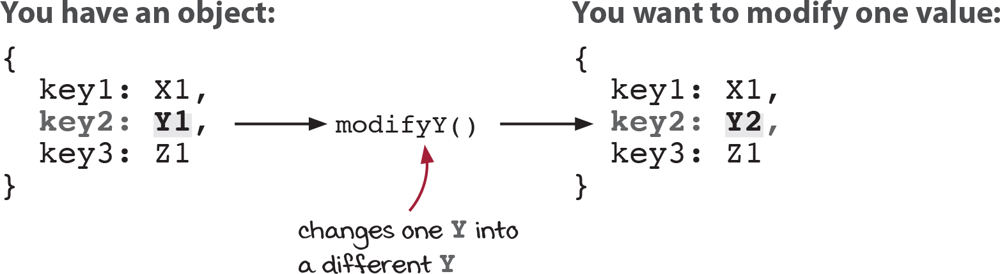

  `update()` 需要三個參數：
  - (1) 要修改的物件
  - (2) 用於定位要修改值的鍵
  - (3) 用於修改值的函式。

請確保傳入 `update()` 的函式是一個計算函式。該函式會接收一個參數（目前的值），並回傳新的值。

<!-- 再次強調，傳給 `update` 的第三個參數 `modify`，應該是一個純粹的計算函式。 它只做一件事：接收舊的值，回傳新的值。 它不應該有任何其他的副作用，例如修改全域變數或寫入資料庫。這樣才能保證我們整個 `update` 操作是可預測且安全的。 -->

---
layout: center
class: align-center justify-center flex items-center
---
  
```js {*|2,3|4}
function incrementField(item, field) {
    // 將物件（商品）傳入 update()，並指定要修改的屬性（field），將能修改該屬性的回呼函式傳入
    return update(item, field, function(value) {
        return value + 1;// 回呼函式加一後的新屬性傳回
    });
}
```
<!-- 我們再看一次重構後的 `incrementField`。 現在這段程式碼讀起來就像一句話：「更新 item 物件的 field 屬性，更新的方式是將它的值加一」。 這就是宣告式程式設計的美妙之處，我們只描述「做什麼」，而不是「怎麼做」。 -->


---
layout: default
---

# 14.7 將 update() 的行為視覺化

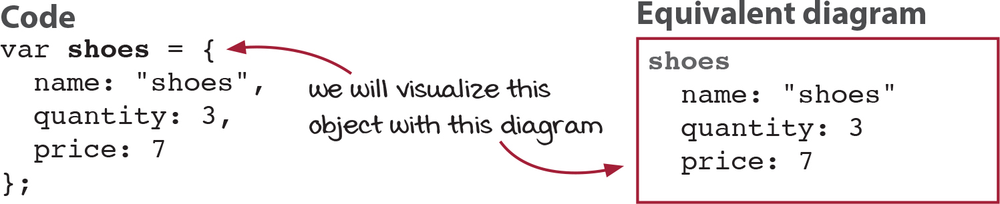

⽬標是執⾏以下指令，將上述物件的商品數量加倍：

```js {*|2}
> update(shoes, 'quantity', function(value) {
    return value * 2; // 數值加倍
});
```

<!-- 接下來，我們透過一個視覺化的方式，一步步拆解 `update` 函式內部到底發生了什麼事。 假設我們的目標是把一個鞋子物件的數量加倍。 -->

---
layout: default
---
⼀步步拆解 `update（ ）`中的操作：

```js {*|2|3|4|*}
function update(object, key, modify) {
    var value = object[key]; // step1 取得屬性值
    var newValue = modify(value); // step2 修改屬性值
    var newObject = objectSet(object, key, newValue); // step3 設定新物件
    return newObject;
}
```

<div v-if="$slidev.nav.clicks === 1">
操作1：取得鍵（key）所指定的物件屬性值（value）
 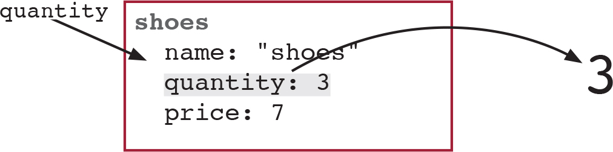
</div>

<div v-if="$slidev.nav.clicks === 2">
操作2：呼叫回呼函式以處理前面取得的屬性值
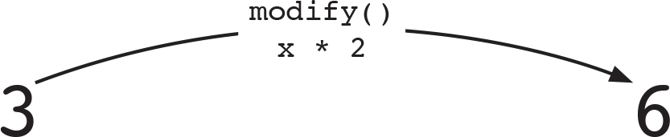
</div>
<div v-if="$slidev.nav.clicks === 3">
操作3：產生具有屬性新值的物件複本
  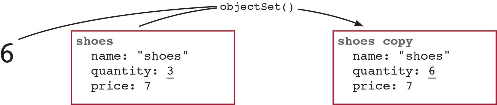
  </div>

<!-- (點擊一次) 第一步，`update` 函式會用傳入的 `key`，也就是 'quantity'，去物件裡取得對應的值，這裡我們得到 2。 (點擊二次) 第二步，`update` 會呼叫我們傳入的 `modify` 回呼函式，並把剛剛取得的值 2 當作參數傳進去。我們的回呼函式會計算 2 * 2，然後回傳結果 4。 (點擊三次) 第三步，`update` 會建立一個新物件。它會複製原始物件的所有屬性，但會用上一步計算出來的新值 4，去覆蓋掉 'quantity' 這個屬性的值。最後，回傳這個全新的物件。 -->


---
  layout: section
---
# 練習 14-1

 `lowercase()` 的函式，可以將傳入的字串轉換為小寫。使用者的電子郵件地址存放在 `email` 鍵下。使用 `update()` 將 `email` 屬性的值全部轉換為小寫。


```js
var user = {
    firstName: "Joe",
    lastName: "Nash",
    email: "JOE@EXAMPLE.COM",
    …
};
```


## 解答
<v-click>

```js 
> update(user, 'email', lowercase) 
  
{ 
    firstName: "Joe", 
    lastName: "Nash", 
    email: "joe@example.com", 
    … 
}
```

</v-click>

<!--這裡有一個 `user` 物件，和一個可以把字串轉成小寫的 `lowercase` 函式。請大家想一下，要怎麼用 `update` 函式，把 `user` 物件裡的 `email` 屬性值轉成小寫？(暫停一下，讓大家思考)沒錯，答案就是 `update(user, 'email', lowercase)`。我們把目標物件、目標的鍵、和操作函式傳進去，就完成了。-->

---
layout: section
---

# 練習 14-2

Mega Mart 的行銷部門想讓顧客更容易大量採購。為此，他們規劃在購買頁面加入一個『10x』按鈕，能直接將目前的商品數量乘以10。你的任務是利用 `update()` 撰寫一個名為 `tenXQuantity()` 的函式，能將商品物件（item）中的數量（quantity）屬性值乘以10。以下是 item 物件的範例：

```js {*|4}
var item = {
    name: "shoes",
    price: 7,
    quantity: 2, // 將此屬性值乘以10
    …
};
```

## 解答

<v-click>
```js
function tenXQuantity(item) { 
    return update(item, 'quantity', function(quantity) { 
        return quantity * 10; 
    }); 
}

```
</v-click>

--- 
layout: section
---

# 練習 14-3

<div grid="~ cols-2 gap-4">
 <div>
請參考以下資料結構與可使用的3個函式：

<br/>

```js
var user = {
    firstName: "Cindy",
    lastName: "Sullivan",
    email: "cindy@randomemail.com",
    score: 15,
    logins: 3
};
```
</div>
 <div>
本題組可用的函式：

- `increment()`: 將給定屬性的值加1。
- `decrement()`: 將給定屬性的值減1。
- `uppercase()`: 將給定字串的字母轉為大寫。

</div>
</div>

1. 請問以下程式碼會輸出什麼結果？
<div grid="~ cols-2 gap-4">
```js
> update(user, 'score', increment).score
```
<v-click>
```js
16
```
</v-click>
</div>


2. 請問以下程式碼會輸出什麼結果？
<div grid="~ cols-2 gap-4">
```js
> update(user, 'logins', decrement).score
```
<v-click>
```js
15
```
</v-click>
</div>

3. 請問以下程式碼會輸出什麼結果？
<div grid="~ cols-2 gap-4">
```js
> update(user, 'firstName', uppercase).firstName
```
<v-click>
```js
"CINDY"
```
</v-click>
</div>


---
layout: section
---

## update() 能處理巢狀資料嗎？


```js {*|4,5,6,7|11,12,13,14,15|}
var shirt = {
    name: "shirt",
    price: 13,
    options: { // shirt 物件中還有 options 物件，形成巢狀結構
        color: "blue",
        size: 3 // 必須存取到options 物件裡面的屬性值
    }
};
 

function incrementSize(item) {
    var options = item.options; //取得
    var size = options.size; //取得
    var newSize = size + 1; // 修改
    var newOptions = objectSet(options, 'size', newSize); // 設定
    var newItem = objectSet(item, 'options', newOptions); // 設定
    return newItem;
}
```

<!--
好的，`update()` 對於單層的物件來說非常好用。但如果遇到巢狀資料呢？這在實際開發中非常常見。
大家可以看到，這個 `shirt` 物件裡面，還有一個 `options` 物件。
如果我們想修改 `size`，就不能直接用 `update()` 了，因為 `size` 不在第一層。
`incrementSize` 這個函式就展示了我們目前必須手動處理的方式。
要先取得 `options`，再取得 `size`，修改完後，要先建立一個新的 `options` 物件，再建立一個新的 `item` 物件。
這個過程非常繁瑣，而且每一層都重複了「取得、修改、設定」的模式。
這就引導出我們接下來要思考的問題：我們能不能用 `update()` 來簡化這個過程呢？
-->
---
layout: default
---

# 14.8 將巢狀資料的 update() 視覺化

<div grid="~ cols-2 gap-4">

```js {*|2,3|4,5|6,7|8,9|10,11|}
function incrementSize(item) {
    //step1
    var options = item.options; //取得
    //step2
    var size = options.size; //取得
    //step3
    var newSize = size + 1; // 修改
    //step4
    var newOptions = objectSet(options, 'size', newSize); // 設定
    //step5
    var newItem = objectSet(item, 'options', newOptions); // 設定
    return newItem;
}
```

<div v-if="$slidev.nav.clicks === 1">
操作 1：取得鍵（key）所指定的物件
 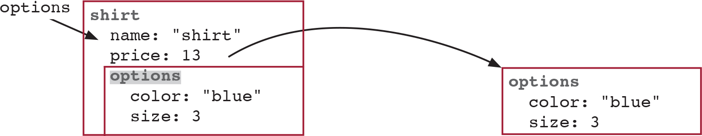
</div>

<div v-if="$slidev.nav.clicks === 2">
操作 2：取得鍵（key）所指定的物件屬性值（value）
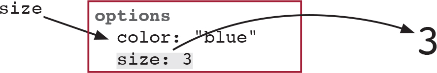
</div>
<div v-if="$slidev.nav.clicks === 3">
操作 3：產⽣屬性新值
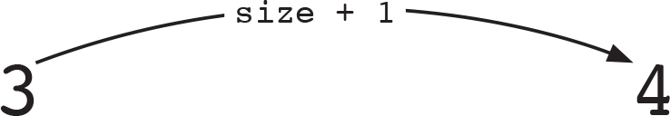
  </div>
  <div v-if="$slidev.nav.clicks === 4">
操作 4：產生具有數性新值的物件複本
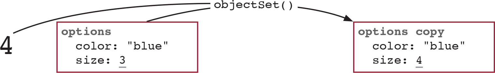
  </div>
    <div v-if="$slidev.nav.clicks === 5">
操作 5： 產⽣具有屬性新值的物件複本
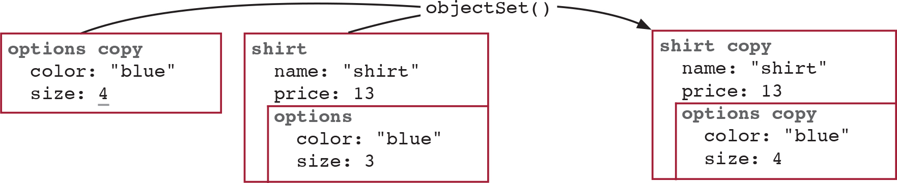
  </div>

</div>

---
layout: default
---
# 14.9 用 update() 處理巢狀資料

以 `update()`重構 `incrementSize()`
```js 
function incrementSize(item) {
    var options = item.options; // 取得
    var size = options.size; // 取得
    var newSize = size + 1; // 修改
    var newOptions = objectSet(options, 'size', newSize); // 設定
    var newItem = objectSet(item, 'options', newOptions); // 設定
    return newItem;
}
```


---
layout: section
---


重構 3 的步驟

1. 辨識『取得』、『修改 』與『設定』程式段落。
2. 利用 `update()`  取代以上三個段落 ，其中『修改』的部分為回呼 。

<div v-click.hide>原始程式</div>

<div v-after>重構後</div>

````md magic-move {at:1, lines: true}


```js
function incrementSize(item) {
    var options = item.options; // 取得
    var size = options.size; // 取得
    var newSize = size + 1; // 修改
    var newOptions = objectSet(options, 'size', newSize); // 設定
    var newItem = objectSet(item, 'options', newOptions); // 設定
    return newItem;
}
```

```js 
function incrementSize(item) {
    var options = item.options; // 取得


    var newOptions = update(options, 'size', increment); // 修改  
    var newItem = objectSet(item, 'options', newOptions); // 設定
    return newItem;
}

```

```js 

function incrementSize(item) {
    return update(item, 'options', function(options) {
        return update(options, 'size', increment);
    });
}

```
````

---
layout: default
---

# 14.10 實作成普適化的updateOption（）


```js
var shirt = {
    name: "shirt",
    price: 13,
    options: {
        color: "blue",
        size: 3
    }
};
```

```js {*|3|*}
function incrementSize(item) {
    return update(item, 'options', function(options) {
        return update(options, 'size', increment); // 可以看到，函式名稱中又出現了隱性引數，而且還出現了兩個
    });
}

```
由於 size 屬性值位於兩層巢狀結構內（經過兩個物件才能取得該值），故需呼叫兩次 update（）。

**資料的巢狀深度有多少，update（）的巢狀呼叫次數就有多少**

---
layout: section
---
將引數改為顯性：先處理 size（隱性屬性名稱），再處理 increment（隱性修改操作）


````md magic-move {at:1, lines: true}


```js {*|1,2,4|*}
// 1.包含隱性屬性名稱
function incrementSize(item) {
    return update(item, 'options', function(options) {
        return update(options, 'size', increment);
    });
}
```

```js {*|1,2,4|}
// 2.改為顯性屬性名稱
function incrementOption(item, option) { 
    return update(item, 'options', function(options) {
        return update(options, option, increment);
    });
}

```

```js {*|1,2,4|*}
// 3.包含隱性修改操作
function incrementOption(item, option) {
    return update(item, 'options', function(options) {
        return update(options, option, increment);
    });
}

```
```js {*|1,2,4|*}
// 4.改為隱性修改操作
function updateOption(item, option, modify) {
    return update(item, 'options', function(options) { // 函式名稱仍有隱性引數
        return update(options, option, modify);
    });
}

```
````
---
layout: default
---

# 14.11 實作兩層巢狀結構的 update２()

````md magic-move {at:1, lines: true}


```js 
// 1.包含隱性引數
function updateOption(item, option, modify) {
    return update(item, 'options', function(options) {
        return update(options, option, modify);
    });
}
```

```js 
// 2.改為顯性引數
function update2(object, key1, key2, modify) { //函式名稱中的2表示用於兩層巢狀結構
    return update(object, key1, function(value1) {
        return update(value1, key2, modify);
    });
}

```
````

<div v-if="$slidev.nav.clicks === 0">
- 此處的 option 隱藏在函式名稱中，需改成顯性引數
</div>
<div v-if="$slidev.nav.clicks === 1">
將外層的Key 參數名改爲 key1，內層的Key 參數名改爲 key2，並將 item 改為 object
</div>
---
layout: default
---

比較一下重構後的版本：

對 options 的 size 屬性加 1 的操作：

```js
var shirt = {
    name: "shirt",
    price: 13,
    options: {
        color: "blue",
        size: 3
    }
};
```


<p v-if="$slidev.nav.clicks === 0">原始程式</p>
<p v-if="$slidev.nav.clicks === 1"> 改以 update2() 實作</p>

````md magic-move {at:1, lines: true}


```js 
function incrementSize(item) {
    var options = item.options;
    var size = options.size;
    var newSize = size + 1;
    var newOptions = objectSet(options, 'size', newSize);
    var newItem = objectSet(item, 'options', newOptions);
    return newItem;
}
```

```js 
function incrementSize(item) {
 
    return update2(item, 'options', 'size', function(size) {
        return size + 1;
    });
 
 
}

```
````
---
layout: default
---

# 14.12 視覺化說明 update2（）如何操作巢狀物件

## 路徑 (path) 

用來定位巢狀物件中之屬性值的鍵序列，其中每一個鍵對應一個巢狀層。

> 本例的目標是『對 size 屬性值加 1』。
為此  `update2（）`需先取得 item 物件，
接著進入『'options'』鍵所指定的物件，然後才能存取到『'size'』鍵的值。

```js

> return update2(shirt, 'options', 'size', function(size) {
        return size + 1; // 對 size 屬性值加 1
    });
```

'options', 'size' 通往目標屬性的路徑

---
layout: center

---

需要處理的商品物件如下：

<div class="flex gap-4">


```js
var shirt = {
    name: "shirt",
    price: 13,
    options: {
        color: "blue",
        size: 3
    }
};
```


  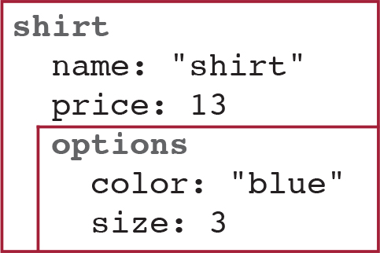
</div>

---
layout: section

---

## 進入巢狀結構 （取得一>取得一>修改）

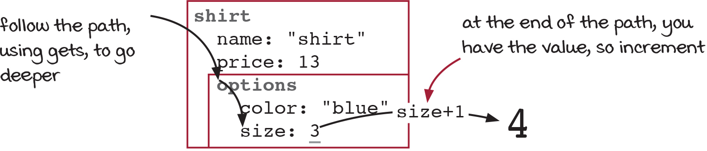

---
layout: section
---

## 離開巢狀結構（設定 ⼀> 設定）

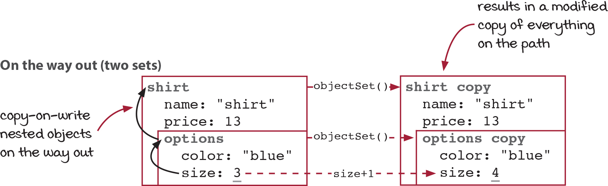


---
layout: section

---

# 牛刀小試 第一題 (選擇題)
<br/>

## 1. `update()` 函式，其主要用途是什麼？
<br/>
<br/>

- A 直接修改原始物件中的屬性值。 
- B 建立一個物件的深層複製。
- C 接受一個物件、一個鍵和一個修改函式，並回傳一個屬性值被更新後的新物件。 
- D 刪除物件中的特定屬性。

<v-click>
 
## 解答：C 

`update()` 是一個高階函式，它遵循「寫入時複製」原則，接收一個修改函式來處理指定屬性，並回傳一個新的物件，而不會更動到原始物件。
</v-click>

---
layout: section

---

# 牛刀小試 第二題 (簡答題)
<br/>

## 2.`update()` 可以用來重構「取得、修改、設定」的程式碼模式。請問這個模式具體是指哪三個步驟？
<br/>
<br/>

<v-click>

## 解答：


1. 取得 (Get): 從物件中讀取一個屬性的值。
2. 修改 (Modify): 對該值進行運算或處理，產生一個新值。
3. 設定 (Set): 建立一個原始物件的複本，並將新值設定到對應的屬性上。

</v-click>

---
layout: section
---

# 牛刀小試 第三題 (選擇題)

<br/>

## 3. `incrementQuantity(item)` 和 `incrementSize(item)` 這類函式重構為 `incrementField(item, field)`。這個重構過程主要體現了哪個重要的程式碼改善原則？


- A 將隱性引數（Implicit Argument）轉換為顯性引數（Explicit Argument）。
- B 使用了更高階的函式。
- C 減少了函式的呼叫堆疊深度。
- D 應用了遞迴。
<v-click>

## 解答：Ａ

這個重構的關鍵在於，原本隱藏在函式名稱中的屬性名稱（如 quantity 或 size）被提取出來，變成了一個明確傳入的參數 field，這使得函式更加通用和可複用。

</v-click>

---
layout: default
---

## 當遇到三層巢狀結構？

<br/>

<div class="flex gap-4">
```js
var cart = {
    shirt: {
        name: "shirt",
        price: 13,
        options: {
            color: "blue",
            size: 3
        }
    }
}
```

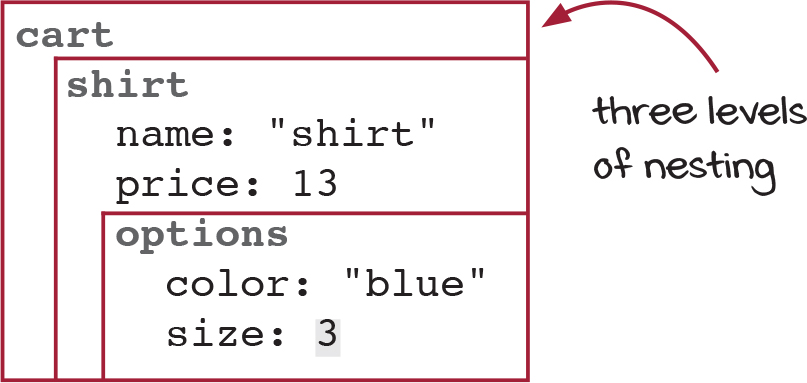
</div>

---
layout: default

---

# 14.13 函式incrementSizeByName()的4種實作方法
此函式能接受購物⾞ cart 參數和商品名 name 參數，然後將購物⾞內對應商品的 size 屬性值（位於 options 物件中）加 1。

<div grid="~ cols-2 gap-1">

<div>
<p class="text-sm"> 方法1: 使⽤ `update()` 和 `incrementSize()`</p>

```js
function incrementSizeByName(cart, name) {
    return update(cart, name, incrementSize);
}
```
</div>
<div>
<p class="text-sm"> 方法2：使⽤ `update()` 和 `update2()`</p>

```js
function incrementSizeByName(cart, name) {
    return update(cart, name, function(item) {
        return update2(item, 'options', 'size', function(size) {
            return size + 1;
        });
    });
}
```
</div>


</div>
---
layout: section
---

<p class="text-sm"> 方法3：只⽤ `update()` </p>
```js
function incrementSizeByName(cart, name) {
    return update(cart, name, function(item) {
        return update(item, 'options', function(options) {
            return update(options, 'size', function(size) {
    return size + 1;
            });
        });
    });
}
```


<p class="text-sm">方法4：⾃⾏實作所有『 取得 、 修改 、 設定 』步驟</p>

```js
function incrementSizeByName(cart, name) {
    var item    = cart[name];
    var options  = item.options;
    var size    = options.size;
    var newSize  = size + 1;
    var newOptions = objectSet(options, 'size', newSize);
    var newItem  = objectSet(item, 'options', newOptions);
    var newCart  = objectSet(cart, name, newItem);
    return newCart;
}
```

---
layout: default
---

# 14.14 實作三層巢狀結構的 update3 ()

<div class="flex gap-4">
<div>
<p v-if="$slidev.nav.clicks === 0">方法二</p>
<p v-if="$slidev.nav.clicks === 1">重構後</p>

````md magic-move {at:1, lines: true}
```js
function incrementSizeByName(cart, name) {
    return update(cart, name, function(item) {
        return update2(item, 'options', 'size', function(size) {
            return size + 1;
        });
    });
}

```

```js
function incrementSizeByName(cart, name) {
    return update3(cart, name,'options', 'size',
     function(size) {
        return size + 1;
    });
}

function update3(object, key1, key2, key3, modify) {
    return update(object, key1, function(object2) {
        return update2(object2, key2, modify);
    });
}
```
```

````
</div>
<div v-if="$slidev.nav.clicks === 0">

1. 辨識出函式名稱裡的隱性引數，擷取成 `update3()` 。
2. 加入新參數以接收顯性輸入。
3. 利用新參數取代函式實作中的固定值

</div>

<div v-if="$slidev.nav.clicks === 1">
`update3()`參數

- `object`：購物車物件
- `key1`：商品名稱
- `key2`：商品名稱內的 options 物件
- `key3`：商品名稱內 options 物件中的屬性
- `modify`：用於修改值的函式

`update3()` 相當於 『 在 `update()` 中呼叫 `update2()` 』。
</div>
</div>

---
layout: section

---

# 練習 14-4


## 實作 update4()

<v-click>

```js
function update4(object, k1, k2, k3, k4, modify) { 
    return update(object, k1, function(object2) { 
        return update3(object2, k2, k3, k4, modify); 
    });  
}
```
</v-click>


## 實作 update5()

<v-click>

```js
function update5(object, k1, k2, k3, k4, k5, modify) {
    return update(object, k1, function(object2) {
        return update4(object2, k2, k3, k4, k5, modify);
    });
}
```
</v-click>

---
layout: default
---
# 14.15 實作任意與狀深度的 nestedUpdate()

觀察以下規律：
```js

function update3(object, key1, key2, key3, modify) {
    return update(object, key1, function(value1) {
        return update2(value1, key2, key3, modify);
    });
}

function update4(object, key1, key2, key3, key4, modify) {
    return update(object, key1, function(value1) {
        return update3(value1, key2, key3, key4, modify);
    });
}
```

要定義 `updateX()` ，只要在 `update()` 中呼叫 `updateX - 1()` 即可︔
此時 `update()` 會使⽤第⼀個鍵，剩餘的鍵則按順序、連同 `modify` 函式引數一起傳給
`updateX - 1()`。

X 剛好等於鍵的個數、而這些鍵又共同組成路徑，可以將 X 解釋成『路徑長度』或『巢狀深度』。

---
layout: full
---
`update2()` 的實作如下︰
```js
function update2(object, key1, key2, modify) {
    return update(object, key1, function(value1) {
        return update1(value1, key2, modify);
    });
}
```
`update1()` 又如何呢？注意 X - 1 會變成 0
```js
function update1(object, key1, modify) {
    return update(object, key1, function(value1) {
        return update0(value1, modify);
    });
}
```
`update0()`無法套用該模式： 

1. `update0()` 中沒有鍵，因此無法呼叫 `update()`（沒有『第一個鍵』可供 `update()` 使用）。 
2. 此處的 X - 1 會變成 - 1，這並非合理的路徑長度。
```js
function update0(value, modify) {
    return modify(value);
}
```
---
layout: center

---
從剛剛的觀察發現程式再度飄出『函式名稱中的程式碼異味』：

# 函式名稱中的數字總是和鍵的數量相同

---
layout: default

---

## 將隱性引數轉為顯性

```js
function update3(object, key1, key2, key3, modify) {
    return update(object, key1, function(value1) {
        return update2(value1, key2, key3, modify);
    });
}

```
<v-click>
加入⼀個代表『 巢狀深度 』 的 depth 參數 ：

```js
function updateX(object, depth, key1, key2, key3, modify) {
    return update(object, key1, function(value1) {
        return updateX(value1, depth-1, key2, key3, modify);
    });
}
```
以上改寫確實讓『巢狀深度』變顯性了，
但如何確保 depth 的值應該要和鍵的數量相同呢？
</v-click>

<v-click>
假如將所有鍵按順序存成一個陣列（也就是將 key1、key2、key3、…，改用一個 keys 陣列取代），那就不需設額外的 depth 參數了，也就是說該陣列的長度（即：元素數量）就是『巢狀深度』！

```js
function updateX(object, keys, modify) {} //keys 包含所有鍵的陣列
```
</v-click>
---
layout: default
---

先將陣列中的第⼀個鍵取出並傳入 `update（）`，然後把排在後面的那些鍵存成「restOfKeys」陣列再傳給 `updateX（）`。注意！restOfKeys 陣列的長度為 X - 1 ：

```js {*|2|3|*} 
function updateX(object, keys, modify) {
    var key1 = keys[0]; //呼叫 update（）時傳入第一個鍵
    var restOfKeys = drop_first(keys); //在遞迴呼叫之前，先把第一個鍵從 keys 陣列中刪除
    return update(object, key1, function(value1) {
        return updateX(value1, restOfKeys, modify);
    });
}
```

除了 `update0()` 以外，以上實作可適用於所有正整數。
---
layout: default   
---
## update0()

```js
function update0(value, modify) {
    return modify(value);
}
```

只需多加一個判斷式：若 keys 陣列的長度為零（即：沒有鍵），則直接呼叫 `modify()`，否則遞迴呼叫 `updateX()`。

````md magic-move {at:1, lines: true}
```js
function updateX(object, keys, modify) {
 
 
    var key1 = keys[0];
    var restOfKeys = drop_first(keys);
    return update(object, key1, function(value1) {
        return updateX(value1, restOfKeys, modify);
    });
}
```

```js
function updateX(object, keys, modify) {
    if(keys.length === 0)
      return modify(object);
    var key1 = keys[0];
    var restOfKeys = drop_first(keys);
    return update(object, key1, function(value1) {
        return updateX(value1, restOfKeys, modify);
    });
}
```
```

````

<br/>

### 遞迴基本條件(base case)

所有遞迴呼叫皆應收斂到某種不涉及遞迴呼叫的情況，稱為基本條件。

---
layout: default
---
## 修改函式名稱

將updateX()改成 nestedUpdate()

````md magic-move {at:1, lines: true}
```js
function updateX(object, keys, modify) {
    if(keys.length === 0)
      return modify(object);
    var key1 = keys[0];
    var restOfKeys = drop_first(keys);
    return update(object, key1, function(value1) {
        return updateX(value1, restOfKeys, modify);
    });
}
```

```js
function nestedUpdate(object, keys, modify) {
    if(keys.length === 0)
      return modify(object);
    var key1 = keys[0];
    var restOfKeys = drop_first(keys);
    return update(object, key1, function(value1) {
        return nestedUpdate(value1, restOfKeys, modify);
    });
}
```
```

````
---
layout: section

---


# 什麼是遞迴 ？

<v-click>

定義⼀個函式時，你可以在實作中呼叫任何東西，包括你正在定義的函式本身。這種『在定義中呼叫自己』的做法就叫做遞迴（recursive），
`nestedUpdate()`  就是很好的例子。

```js
function nestedUpdate(object, keys, modify) {
    if(keys.length === 0)
      return modify(object);
    var key1 = keys[0];
    var restOfKeys = drop_first(keys);
      return update(object, key1, function(value1) {
      return nestedUpdate(value1, restOfKeys, modify);
    });
}
```
</v-click>

---
layout: section
---

# 為什麼要⽤遞迴這麼難懂的方式寫程式？

<v-click>

遞迴寫法特別適合對付巢狀資料。

操作巢狀資料時，往往需對每個層做類似處理，而遞迴函式剛好能做到這一點
（每一層都呼叫該函式，只不過傳入不同引數）。
</v-click>
<v-click>

# 難道不能用較好理解的 for 迴圈達到同樣的目的嗎?
</v-click>

<v-click>

遞迴可利用函式呼叫堆疊（stack）追蹤每一輪的引數與傳回值。

要是使用for週圈，則必須自行處理此問題。

總而言之，有了JavaScript的堆疊功能，我們不必手動push和pop（將資料放進堆疊稱為push，移出則稱為pop），故省去了許多麻煩
</v-click>
---
layout: section
---

# 但遞迴不會很危險嗎︖ 萬一產生無限迴圈或記憶體溢位怎麼辦？

<v-click>

遞迴的確有可能造成無限迴圈。

此外，根據你的實作和所用語言，函式呼叫致於有可能遞迴太多次以至於堆疊空間不足。

</v-click>

---
layout: default
---
# 14.16 安全的遞迴需要具備什麼？


## 1 .⼀定要有基本條件

<p>要防止遞迴無限循環下去，就一定要<span v-mark="{  color: 'red', type: 'underline' }">定義不含任何遞迴呼叫</span>的 <span v-mark="{  color: '#234', type: 'circle' }">基本條件</span>，並以此當做終點。</p>

  ```js {*|2,3,|*}
  function nestedUpdate(object, keys, modify) {
      if(keys.length === 0) // 基本條件
        return modify(object); //其中不含任何遞迴呼叫
      var key1 = keys[0];
      var restOfKeys = drop_first(keys);
        return update(object, key1, function(value1) {
        return nestedUpdate(value1, restOfKeys, modify);
      });
  }
  ```

基本條件通常發生在 『 當某次呼叫的傳入引數為空陣列 』 、 『 遞減變數值變成 0 』
或 『 答案已經找到 』時 。 

---
layout: default

---

## 2. 弄清楚遞迴的條件

<p>遞迴函式的定義中<span v-mark="{  color: 'red', type: 'underline' }">至少要包含一次遞迴條件</span>，也就是包含了遞迴呼叫的敘述。</p>
此處同樣以
`nestedUpdate()`為例:
```js {*|5,7|*}
function nestedUpdate(object, keys, modify) {
    if(keys.length === 0) 
      return modify(object); 
    var key1 = keys[0];
    var restOfKeys = drop_first(keys);// 每經過一次遞迴呼叫，restOfKeys 就會少一個元素
      return update(object, key1, function(value1) {
      return nestedUpdate(value1, restOfKeys, modify);//遞迴呼叫
    });
}
```

<v-click>


## 3. 確定函式呼叫有朝著基本條件前進

必須確保其中至少有⼀個引數正在『變小』，並且使得呼叫條件越來越接近基本條件。

舉例：假如『以空陣列做遞迴呼叫』是基本條件，那每次遞迴時就要移除該陣列的一個元素。

</v-click>

---
layout: default
---

# 14.17 將 nestedUpdate() 的行為視覺化

```js
> nestedUpdate(cart, ["shirt", "options", "size"], increment)
```

下方為巢狀結構執行狀態的堆疊（Stack）圖，每呼叫一次 `nestedUpdate()`就往下堆疊一層，直到執行`modify()`，然後再一層一層執行`objectSet()`從堆疊中移除。

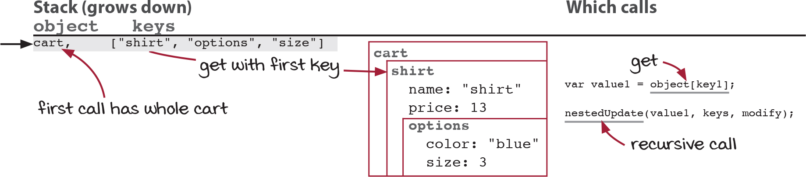
  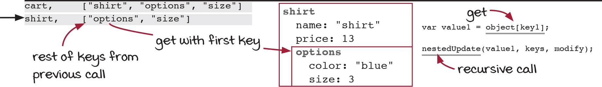

---
layout: full
---

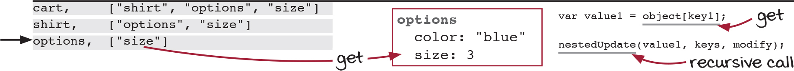
  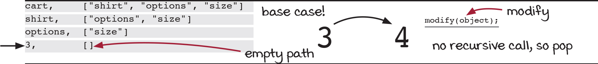
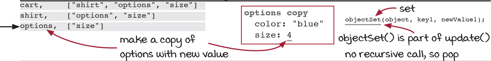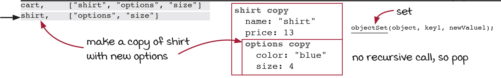
---
layout: full
---

  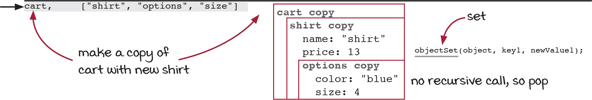
  
---
layout: default
---

# 14.18 比較遞迴和迴圈

## 迴圈

迴圈⾛訪陣列時，程式會從索引0開始， ⼀邊處理其中的元素，⼀邊將⽣成的結果加到傳回陣列末端，如下圖所示：


---
layout: full

---


巢狀資料的操作⽅式則不⼀樣：我們需要先⼀層⼀層進⾏『取得』，接著『修改』⽬標屬性值，最後再循環相反方向完成每⼀層的
『設定』。此外，因為使用了『寫入時複製』，故『設定』其實會產生資料複本：

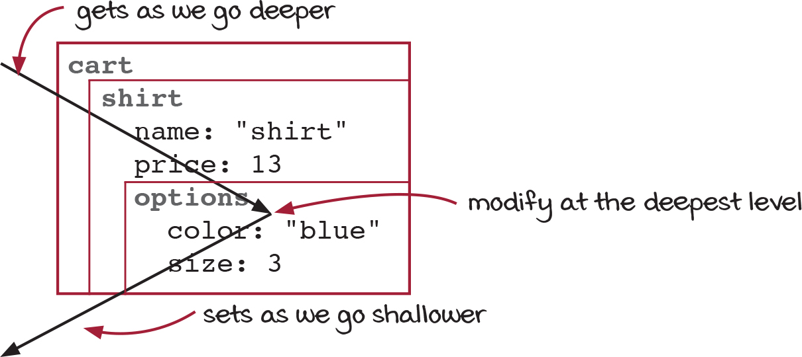


事實上，『取得、修改、設定』的巢狀執行方式恰好反映巢狀結構，而這樣的構造很難不使用遞迴和呼叫堆疊實現。
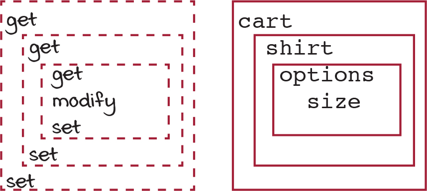

---
layout: section
---

# 練習 14-5
在 14.13 節已介紹過 incrementSizeByName() 的四種實作方法。在此請各位利用
nestedUpdate() 寫出第五種實作：

```js
> function incrementSizeByName (cart, name) {}
```

<v-click>
```js
function incrementSizeByName(cart, name) { 
    return nestedUpdate(cart, [name, 'options', 'size'],
        function(size) {
            return size + 1;
    });
}
```
</v-click>

---
layout: default
---

# 14.19 遇到深度巢狀資料時的設計考量

用 `nestedUpdate()` 處理深度巢狀資料時，可能會遇到以下問題：

需要傳入一長串鍵作為路徑，但我們很難記得這些鍵到底指的是什麼？

ex:

```js

httpGet("http://my-blog.com/api/category/blog", function(blogCategory) {
    renderCategory(nestedUpdate(blogCategory, ['posts', '12', 'author', 'name'], capitalize));
});

```

每一個巢狀層都有自己的資料結構，必須記得這些結構，才能了解路徑的意思。

---
layout: default

---

# 14.20  為巢狀資料建立抽象屏障

## 抽象屏障（abstraction barrier）:

是有效隱藏實作細節的函式層，有了它，使用屏障中的函式時，完全不需要了解函式的底層實作。
<br/>

舉例：建立可操作目標資料結構的函式，並且賦予這些函式有意義的名稱。

寫⼀個能根據給定貼⽂編號（ ID ）修改部落格貼⽂（ post ）的函式（貼⽂儲存在 category 巢狀物件的『posts』鍵下）

```js
function updatePostById(category, id, modifyPost) { //不需知道 posts 和 category 的關係也能用
    return nestedUpdate(category, ['posts', id], modifyPost); // 位於屏障上層的程式不必知道 category 的資料結構
}
```
變更作者資訊（user，存放於『author』鍵下）
```js
function updateAuthor(post, modifyUser) {
    return update(post, 'author', modifyUser);
}
```

---
layout: default
---

將作者名字改為大寫（利用 capitalize() 完成），所以需再實作能取得「name」屬性的函式，並傳入 capitalize() 

```js
function capitalizeName(user) {
    return update(user, 'name', capitalize);
}
```
結合以上，就可以得到：

```js
updatePostById(blogCategory, '12', function(post) {
    return updateAuthor(post, capitalizeUserName);
});
```
<br/>

## 使用抽象屏障優點

- 函式的名稱簡單易懂
- 不知道鍵的名稱也能夠順利修改目標屬性

---
layout: default
---

# 14.21 總結高階函式的應用

## 在⾛訪陣列時取代for迴圈

`forEach（）`、`map（）`、`filter（）`、與`reduce（）`，皆是能操作陣列的⾼階函式。你可以將它們串連成鏈，以實現更複雜的計算。

## 有效處理巢狀資料

要改變巢狀資料中的值非常麻煩，不僅需進行多次『取得』，還得對每一層的物件做『寫入時複製』。為此，我們實作了 `update（）` 和 `nestedUpdate（）` — 無論巢狀結構有多深，這兩個高階函式都能精準更改指定屬性值。

---
layout: section
---

## 套用『寫入時複製』

『寫入時複製』的步驟是固定的（即：產生複本、修改複本、傳回複本），故實作時可能產生重複程式碼。但只要使用 `withArrayCopy（）` 和 `withObjectCopy （）`，就能把任意操作協調成『寫入時複製』版本。以上兩個高階函式是將固定程式標準化的極佳範例。

## 將 try/catch 敘述標準化

我們曾寫過名為 `wrapLogging（）` 的高階函式：其可接受任意函式`f`，並傳回功能和「相同，但多了 `try/catch` 錯誤捕捉能力的新函式。這個例子讓我們瞭解：高階函式可改變其他函式的行為。

---
layout: default
---

# 重點整理

- 函數式工具 `update()` 能修改物件中的指定屬性值，為我們免去手動取得屬性值、修改，然後再將結果設定回物件中的麻煩。

- `nestedUpdate()` 能處理深度巢狀資料。當知道目標屬性值在巢狀物件中的路徑（由一系列的『鍵』構成）時，就能用此函數式工具輕鬆修改該值。

- 一般來說，迴圈比遞迴容易理解。但面對巢狀資料時，遞迴則比較好用。

- 函式在呼叫自己之前，遞迴會利用函式呼叫堆疊來追蹤目前進度，這使得遞迴函式的構造能反映巢狀資料結構。

- 深度巢狀結構會造成理解困難上的不便。要操作此類資料，你必須記得每一巢狀層的資料結構為何。

- 可以為關鍵資料結構設計抽象屏障，藉此降低需要記憶的細節。


---
layout: section
---

# 牛刀小試 第四題  (簡答題)
<br/>

## 4. 什麼是「遞迴」？為什麼它特別適合用來處理巢狀資料結構？
<br/>

<v-click>

## 解答：

遞迴是指一個函式在其定義中呼叫自己的行為。 它特別適合處理巢狀資料，因為遞迴函式的呼叫堆疊（call stack）結構，能自然地對應巢狀資料的層級結構，讓我們可以先逐層深入（取得），處理完最內層的資料後，再逐層返回（設定），而不需要手動管理狀態。

</v-click>

---
layout: section

---

# 牛刀小試 第五題  (簡答題)
<br/>

## 5. 為了確保遞迴函式能夠安全地執行並避免無限迴圈，需要具備哪三個要素？
<br/>
<br/>

<v-click>

## 解答：

1. 基本條件 (Base Case): 一個不會再進行遞迴呼叫的終止條件。
2. 遞迴條件 (Recursive Step): 函式呼叫自己的部分。
3. 朝著基本條件前進: 每次遞迴呼叫時，傳入的引數都應該要有所改變，使其越來越接近基本條件（例如：處理的陣列越來越短）。

</v-click>

---
layout: section

---
# 牛刀小試 第六題 (選擇題)

<br/>

## 6.在最終的 `nestedUpdate(object, keys, modify)` 函式中，keys 參數的用途是什麼？

- A 要修改的物件屬性名稱。 
- B 一個包含所有物件鍵的陣列，用於迭代。 
- C 一個由鍵組成的陣列，定義了從最外層物件到目標屬性值的「路徑」。 
- D 用於加密的密鑰。

<v-click>

## 解答：C

keys 參數是一個陣列，它依序包含了存取到目標值所需的每一個鍵，形成一個路徑（path），讓 nestedUpdate 知道如何逐層深入到正確的位置

</v-click>

---
layout: section
---
# 牛刀小試 第七題 (簡答題)

<br/>

## 7.當處理深度巢狀資料時，為什麼需要建立「抽象屏障」(Abstraction Barrier)？它能解決什麼問題？

<v-click>

## 解答：C

當資料巢狀很深時，使用 `nestedUpdate` 需要傳入一長串的鍵（路徑），這使得程式碼難以閱讀和維護，因為開發者必須記住複雜的資料結構。

「抽象屏障」透過建立一層具有語意化名稱的函式，將這些複雜的路徑細節隱藏起來，讓其他開發者可以透過呼叫這些有意義的函式來操作資料，而不需要了解底層的資料結構。

</v-click>

---
layout: section
---

# 牛刀小試 第八題 (選擇題)

<br/>

## 8.`update()` 和 `nestedUpdate()` 函式是否會修改傳入的原始物件？

- A 會，它們會直接修改原始物件以節省記憶體。 
- B 不會，它們遵循「寫入時複製」原則，總是回傳一個新的物件。
- C 只有 `nestedUpdate()` 會修改，因為它比較複雜。 
- D 是否修改取決於傳入的 `modify` 函式。

<v-click>

## 解答：B

這兩個函式都是函數式工具，其核心原則之一就是不可變性（Immutability）。它們透過在每一層建立複本的方式來更新值，並回傳一個全新的最外層物件。
</v-click>

---
layout: section
---

# 牛刀小試 第九題 (實作題)

#### 9. 有一個購物車物件 cart，結構如下。請使用 `nestedUpdate()` 函式，將購物車中 pants（褲子）的價格（price）提高 20%。

```js
var cart = {
    shirt: {
        name: "shirt",
        price: 13,
        options: { color: "blue", size: 3 }
    },
    pants: {
        name: "pants",
        price: 25,
        options: { color: "black", size: 4 }
    }
};

function priceIncrease20(price) {
    return price * 1.2;
}

var updatedCart = /* 你的程式碼 */;
```

<v-click>

## 解答：

```js
var updatedCart = nestedUpdate(cart, ['pants', 'price'], priceIncrease20);
```

</v-click>
---
layout: center

---

#  問題與討論

<br/>

## 在前端的開發中，什麼時候會用到遞迴？

<!--

一些常見的例子可能包括：
- **渲染巢狀的 UI 元件**：比如像留言區，回覆會巢狀地顯示在留言底下；或是像 React/Vue 這種元件樹的結構，一個元件裡面又會渲染其他元件。
- **顯示樹狀結構**：例如檔案總管的目錄結構，或是有多層級的導覽選單。
- **處理複雜的 API 回應**：有時候後端回傳的 JSON 資料本身就是巢狀或樹狀的。
- **演算法**：某些搜尋或排序的演算法也可能會用到遞迴。

-->


---
layout: end

---

# 次回日期、章節導讀人及筆記工預告

## 第 15 章 解析時間線(48)

### 日期：7/10
### 導讀人：Lulu
### 筆記工：Blue


